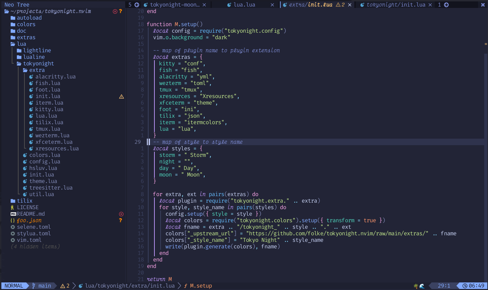

+++
title="Vim/Neovim : le tutoriel pour frimer comme VsCode"
date=2022-11-30T10:14:42+01:00

[taxonomies]
author = ["Vincent Jousse"]
tags = ["vim", "tutoriel", "neovim"]
+++

Dans ce tutoriel je vais vous apprendre à configurer [**Neovim**](https://neovim.io) pour qu'il ressemble le plus possible à un IDE *à la* VsCode. Vous aurez quelque chose de joli, de pratique et qui sent bon la modernité. Voilà un aperçu de ce à quoi il devrait ressembler :

Je ferai en sorte de rendre tout cela compatible *Mac/Windows/Linux*. Mais à ce stade, la première question qui devrait vous brûler les lèvres est : [**Neovim**](https://neovim.io) ?! Mais **pourquoi pas Vim tout court** ? Ça tombe bien, j'allais y venir. Et si vous vous en fichez, vous pouvez aussi directement passer au paragraphe suivant.

<!-- more -->

## Vim, Neovim et le turfu

Même si *Vim* a fait ses preuves depuis sa première version en 1988, au fil des années, il est devenu difficile à maintenir et a commencé à souffrir de problèmes de performances. Il était qui plus est maintenu par une seule personnes, Bram Moolenaar, qui n'était pas connu pour faciliter l'évolution de *Vim*.

En 2014, une partie de la communauté *Vim* décide de *forker* *Vim* sous le nom de : [**Neovim**](https://neovim.io).

Les buts sont multiples : simplifier la maintenance, faciliter les contributions, permettre son intégration dans des éditeurs de code modernes (oui vous pouvez utiliser *Neovim* avec *VsCode*) et améliorer son extensibilité avec une nouvelle architecture de plugins. Bref, en gros l'idée était de préparer *Vim* pour le futur, et c'est chose réussie.

Concrètement, si vous êtes habitué à *Vim*, vous ne verrez aucune différence avec *Neovim*, c'est simple, il est juste 100% compatible. J'utilise par exemple de *vieux* plugins comme [LustyExplorer](https://github.com/vim-scripts/LustyExplorer) qui fonctionnent parfaitement. En revanche vous disposerez d'un *Vim* plus moderne, [activement maintenu](https://github.com/neovim/neovim), avec de nombreux plugins (dont certains spécifiques à *Neovim* écrits en [Lua](https://www.lua.org/)) et donc prêt pour l'avenir et les 30 prochaines années ☺️

🚨 Dans cet article, je n'aborderai pas l'utilisation de *Vim* en tant que tel. Si vous voulez en apprendre plus sur comment l'utiliser efficacement, n'hésitez pas à consulter mon livre, [*Vim pour les humains*](https://vimebook.com/fr).

## Installation de Neovim

Le plus simple est de suivre les instructions directement sur le [Github de Neovim](https://github.com/neovim/neovim/wiki/Installing-Neovim).

En résumé :

### Pour Windows

### Fichier Zip

    Télécharger nvim-win64.zip
    Extraire le fichier zip.
    Lancer `nvim-qt.exe`

### Installateur MSI

    Download nvim-win64.msi
    Run the MSI
    Search and run nvim-qt.exe or run nvim.exe on your CLI of choice.

## Installation d'un gestionnaire de Plugin

Il existe plusieurs gestionnaires de plugins dans le monde *Vim* et *Neovim*. Le standard pour *Neovim* s'appelle [Packer](https://github.com/wbthomason/packer.nvim) et il est écrit en [Lua](https://www.lua.org/) (le langage utilisé pour programmer des scripts sous *Neovim*). J'ai sciemment décidé pour cet article de ne pas l'utiliser et de choisir à la place [vim-plug](https://github.com/junegunn/vim-plug) pour une raison simple : il est aussi beaucoup utilisé dans le monde *Vim* et sera surement beaucoup plus familier pour bon nombre d'entre vous. Ça permettra à certains d'entre vous qui utilisent Vim de ne pas être totalement perdus avec du Lua. Chaque chose en son temps 😊

## Choix du thème Neovim

https://github.com/folke/tokyonight.nvim

## Liens

https://www.linuxuprising.com/2021/03/install-macos-big-sur-or-catalina-in.html
